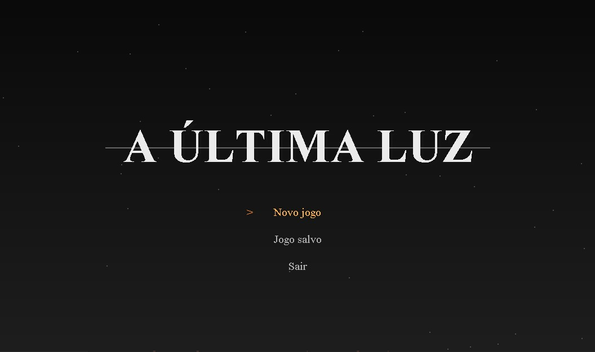

# 🎮 A Última Luz

**A Última Luz** é um protótipo de jogo *soulslike* com elementos de RPG e exploração, desenvolvido como parte de um projeto acadêmico.  
O jogo combina narrativa, ambientação sombria e desafios estratégicos, proporcionando uma experiência imersiva e desafiadora.

---

## 🌍 Ambientação

Em um mundo em constante transformação, o jogador explora diferentes  mapas, enfrentando inimigos e descobrindo fragmentos da história.  
O ciclo **dia/noite** afeta a jogabilidade e a ambientação, tornando o mundo mais dinâmico e vivo.

---

## 👥 Público-Alvo

Voltado para jogadores **a partir de 12 anos**, fãs de **RPGs e jogos de ação** com foco em **exploração, estratégia e progressão**.  
O protótipo foi desenvolvido para a plataforma **PC**.

---

## 🧩 Mecânicas Implementadas

- 🎮 **Game loop funcional** e controle via teclado  
- 🧍‍♂️ **Sprites e animações** personalizadas  
- 🧱 **Sistema de tiles e câmera dinâmica**  
- 💬 **Interações com objetos, NPCs e diálogos**  
- 🎒 **Inventário com itens equipáveis e projetáveis**  
- ⚔️ **Sistema de combate** com vida, mana, atributos e chefões  
- 🌫️ **Eventos ambientais** (buracos, cura, teleporte, iluminação, viagem rápida)  
- 🌙 **Ciclo dia/noite e iluminação dinâmica**  
- 🗺️ **Minimapa e interface** (menus, seleção de classe e tela de game over)  
- 🔍 **Algoritmo A*** (A-Estrela, busca de caminhos inteligente)  
- 💰 **Sistema de comércio e saque de baús**  
- 🎭 **Cutscenes, quebra cabeça e efeitos sonoros** integrados  

---

## 🛠️ Tecnologias e Referências

O desenvolvimento foi inspirado em tutoriais e conceitos apresentados pelo canal [RyiSnow](https://www.youtube.com/@RyiSnow), fundamentais para a estrutura de base do jogo.  
As mecânicas e recursos visuais foram adaptados e expandidos para criar uma experiência única.

---

## ⚙️ Configuração do Ambiente

### 🧰 Requisitos

- **Java JDK** 21 ou superior  
- **Visual Studio Code** com as seguintes extensões:
  - Java Extension Pack (inclui)
    - Language Support for Java™ by Red Hat  
    - Debugger for Java  
    - Java Test Runner  
    - Maven for Java  
    - Visual Studio IntelliCode  

### 🔧 Passos de Instalação

1. Instale o **Java JDK 21**.  
2. Instale o **Visual Studio Code**.  
3. Na aba de extensões do VS Code, instale o **Java Extension Pack**.  
4. Clone o repositório:

   ```bash
   git clone https://github.com/Rafaela-Ferreira/TCC_A_Ultima_Luz.git

## 🖼️ Imagem do Protótipo



## 🧑‍💻 Autoras
- Nancy Miyuki CP3025641 – Desenvolvedora e pesquisadora do projeto.
- Rafaela Ferreira CP3026353 – Desenvolvedora e pesquisadora do projeto.

